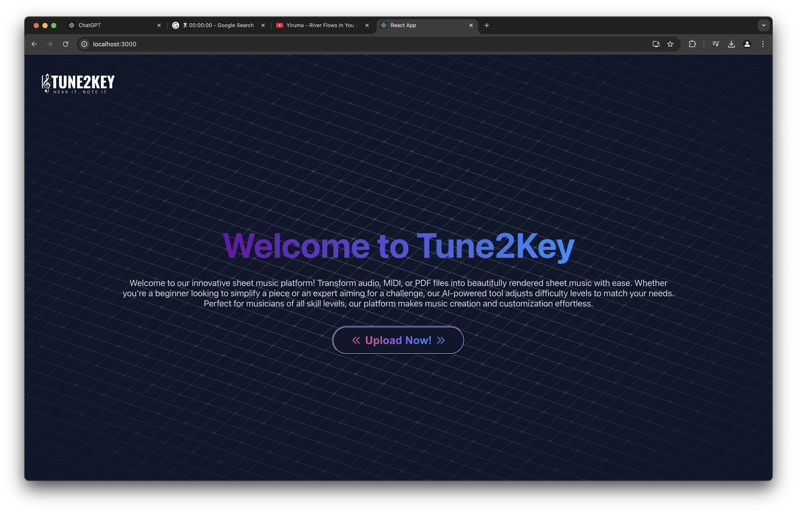

# TUNE2KEY

*TUNE2KEY* is an **innovative platform that transforms audio, MIDI, and PDF files into beautifully rendered sheet music**. (For the expert situation, achieved an onset [F1 score of 96.72%](https://arxiv.org/pdf/2010.01815), surpassing the previous state-of-the-art Onsets and Frames system, which scored 94.80%). Whether you're a **beginner looking to simplify a piece** or **an expert aiming for a challenge, our AI-powered tool** adjusts difficulty levels to match your needs. Perfect for musicians of all skill levels, TUNE2KEY makes music creation and customization effortless.



## Features

- Convert MP3 to Sheet Music
- Simplify MIDI files by converting chords to single notes and quantizing rhythms
- Adjust difficulty levels of music pieces
- Expert user-friendly interface
- Play MIDI files and convert them to MP3

## Installation

(Developed on MacOS 15.1, Python 3.11 environment)

1. Clone the repository:
    ```sh
    git clone https://github.com/yourusername/tune2key.git
    cd tune2key
    ```

2. Install the required dependencies:
    ```sh
    chmod +x install.sh
    ./install.sh
    cd client
    npm install
    cd ..
    ```

3. Ensure MuseScore is installed and available in your system PATH:
    ```sh
    mscore --version
    ```
    If MuseScore is not installed, download it from the [Download Link](https://musescore.org/en/download/musescore.dmg).

## Usage

### Running the Server

1. Start the Backend server:
    ```sh
    cd server
    python app.py
    ```

2. Start the Frontend server: (Open a new terminal)
    ```sh
    cd client
    npm start
    ```

2. Access the web application at `http://localhost:3000`.

### Uploading Files

1. Navigate to the upload page.
2. Upload an MP3, MIDI, or PDF file.
3. The file will be processed, and you will receive the corresponding sheet music and audio files.

## API Endpoints

- `POST /upload`: Upload a file for transcription.
- `GET /music_sheet/<name>`: Retrieve the generated sheet music PDF.
- `GET /audio/<name>`: Retrieve the generated MP3 file.
- `GET /progress/status/<name>`: Retrieve the progress of the transcription. ("status" can be "pending", "processing", or "completed")
- `GET /download/<filename>`: Move the generated music file to client side.

## License

This project is licensed under the MIT License. See the [LICENSE](LICENSE) file for details.

## References

- Hawthorne, Curtis, et al. "High-resolution Piano Transcription with Pedals by Regressing Onset and Offset Times." *arXiv preprint arXiv:2010.01815* (2020). [Read the paper](https://arxiv.org/abs/2010.01815)
- Roberts, Adam, et al. "A Hierarchical Latent Vector Model for Learning Long-Term Structure in Music." *arXiv preprint arXiv:1803.05428* (2018). [Read the paper](https://arxiv.org/abs/1803.05428)
- Huang, Cheng-Zhi Anna, et al. "Simple and Controllable Music Generation." *arXiv preprint arXiv:2306.05284* (2023). [Read the paper](https://arxiv.org/abs/2306.05284)

## Acknowledgements (Third-Party Libraries)

- [FluidSynth](https://github.com/FluidSynth/fluidsynth)
- [music21](http://web.mit.edu/music21/)
- [MuseScore](https://musescore.org/)
